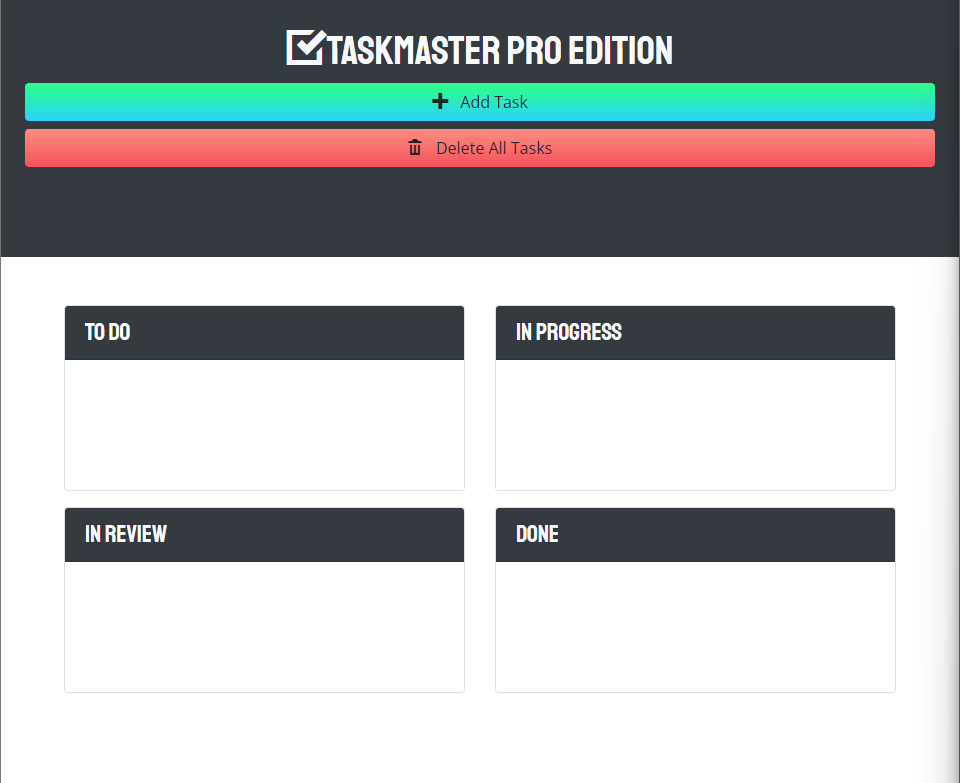
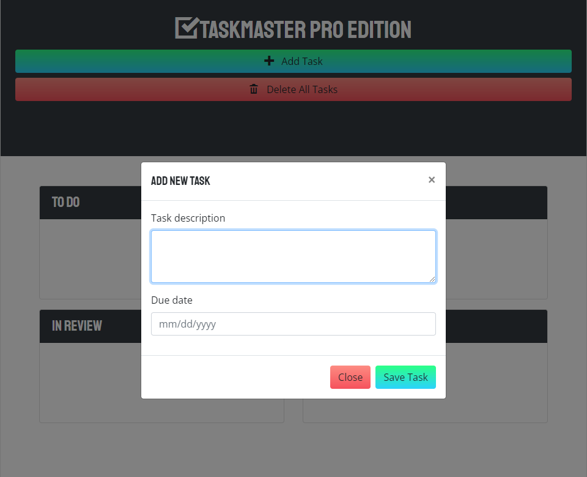

# Taskmaster Pro

  
## Description

A task-management application built using jQuery and Bootstrap!

## Table of Contents

- [Installation](#installation)
- [Usage](#usage)
- [License](#license)
- [Contributing](#contributing)
- [Tests](#tests)
- [Questions](#questions)

## Usage

A user can create tasks and categorize them by dragging and dropping them into "To Do", "In Progress", "In Review", and "Done" boxes. A user can input a task description and due date as well as delete all tasks at once. Data is limited to local storage.

## Installation

No installation required. Clone this repository to your local machine and open in your preferred web browser.

## License
    
Licensed under the [MIT License](https://spdx.org/licenses/MIT.html)

## Contributing

No contributions will be accepted at this time.

## Tests

No testing is planned for this project at this time.

## Questions

Have questions? Reach me at the following sources!

* GitHub: [realnifty](https://github.com/realnifty)
* E-mail: rogelioalbertopedraza@gmail.com or lovecore@pm.me